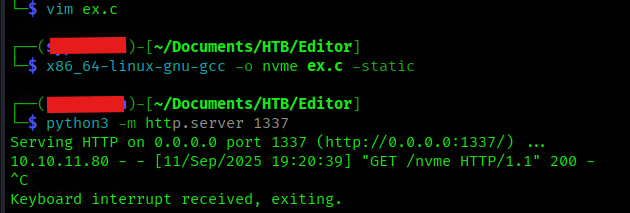
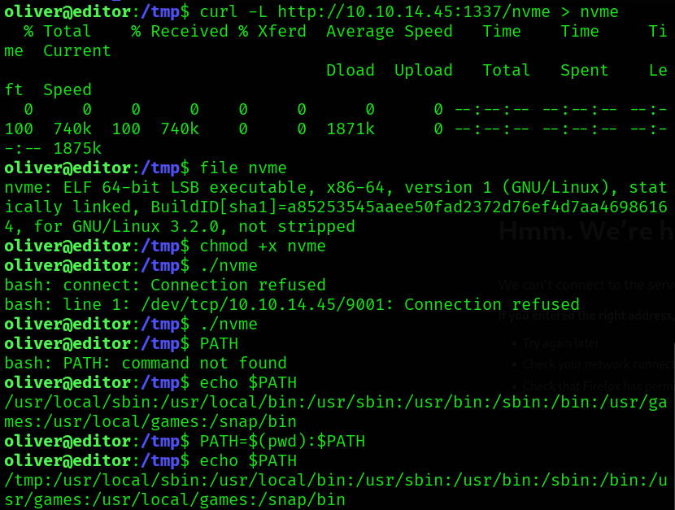

## Nmap Enumeration

```bash
$ nmap -p $(cat ports.txt) -sVC -O --min-rate=1000 editor.htb
Starting Nmap 7.95 ( <https://nmap.org> ) at 2025-08-09 17:15 IST
Nmap scan report for editor.htb (10.10.11.80)
Host is up (0.039s latency).

PORT     STATE SERVICE VERSION
22/tcp   open  ssh     OpenSSH 8.9p1 Ubuntu 3ubuntu0.13 (Ubuntu Linux; protocol 2.0)
| ssh-hostkey: 
|   256 3e:ea:45:4b:c5:d1:6d:6f:e2:d4:d1:3b:0a:3d:a9:4f (ECDSA)
|_  256 64:cc:75:de:4a:e6:a5:b4:73:eb:3f:1b:cf:b4:e3:94 (ED25519)
80/tcp   open  http    nginx 1.18.0 (Ubuntu)
|_http-title: Editor - SimplistCode Pro
|_http-server-header: nginx/1.18.0 (Ubuntu)
8080/tcp open  http    Jetty 10.0.20
| http-title: XWiki - Main - Intro
|_Requested resource was <http://editor.htb:8080/xwiki/bin/view/Main/>
|_http-server-header: Jetty(10.0.20)
|_http-open-proxy: Proxy might be redirecting requests
| http-cookie-flags: 
|   /: 
|     JSESSIONID: 
|_      httponly flag not set
| http-methods: 
|_  Potentially risky methods: PROPFIND LOCK UNLOCK
| http-robots.txt: 50 disallowed entries (15 shown)
| /xwiki/bin/viewattachrev/ /xwiki/bin/viewrev/ 
| /xwiki/bin/pdf/ /xwiki/bin/edit/ /xwiki/bin/create/ 
| /xwiki/bin/inline/ /xwiki/bin/preview/ /xwiki/bin/save/ 
| /xwiki/bin/saveandcontinue/ /xwiki/bin/rollback/ /xwiki/bin/deleteversions/ 
| /xwiki/bin/cancel/ /xwiki/bin/delete/ /xwiki/bin/deletespace/ 
|_/xwiki/bin/undelete/
| http-webdav-scan: 
|   Allowed Methods: OPTIONS, GET, HEAD, PROPFIND, LOCK, UNLOCK
|   WebDAV type: Unknown
|_  Server Type: Jetty(10.0.20)
Warning: OSScan results may be unreliable because we could not find at least 1 open and 1 closed port
Device type: general purpose|router
Running: Linux 4.X|5.X, MikroTik RouterOS 7.X
OS CPE: cpe:/o:linux:linux_kernel:4 cpe:/o:linux:linux_kernel:5 cpe:/o:mikrotik:routeros:7 cpe:/o:linux:linux_kernel:5.6.3
OS details: Linux 4.15 - 5.19, MikroTik RouterOS 7.2 - 7.5 (Linux 5.6.3)
Network Distance: 2 hops
Service Info: OS: Linux; CPE: cpe:/o:linux:linux_kernel

OS and Service detection performed. Please report any incorrect results at <https://nmap.org/submit/> .
Nmap done: 1 IP address (1 host up) scanned in 9.85 seconds
```

We got 3 ports open: 22, 80, 8080; an SSH, a website, and another secondary website which seems to contain documentation of some sort. Let’s explore them


### Port 80


Port 80 contains a code editor website called **SimplistCode Pro.** There are a few hyperlinks on this website except which it is all static. There are two download hyperlinks which allow you to download different versions of the code editor for Windows and Linux. Let’s explore more about this shortly

### Port 8080


Port 8080 contains a documentation kind-of website for the Simplistcode Pro editor.

## Website Enumeration

The website on port 80 doesn’t seem to contain anything useful, no `robots.txt`.

But on 8080, we get a `robots.txt`


It contains a variety of links which are disallowed for bots to crawl upon. All look like they are part of dashboard

Whatever endpoint we try to access, the website is asking for login credentials to access them:


Enumerating the website further, we can find there’s an user/developer named `Neal Bagwell`


Trying various combinations of the name `Neal Bagwell` on the forgot username option of the login page yields us this result:-


So `nealbagwell` is a valid username.

At the bottom of the website, we can notice the XWiki version mentioned:


Googling the same version number, leads us to `CVE-2025-32974`


## CVE-2025-24893

`CVE-2025-24893` is an RCE vulnerability in XWiki which allowed unauthenticated attackers to execute arbitrary Groovy code remotely without authentication or prior access. 

Using https://github.com/D3Ext/CVE-2025-24893 PoC to gain shell access to the system:-


Stabilize the shell using Python likewise:-

`python3 -c 'import pty; pty.spawn("/bin/bash")'`

and after this, `export TERM=xterm` and `export SHELL=bash` → to use utilities like vim, nano etc.

## Owning User

We cannot access the user `oliver`'s directory. Enumerating the system further, we come across the `hibernate.cfg.xml` file of the xwiki installation.


We find a password `theEd1t0rTeam99`. Using it to ssh as `oliver`:-


We get the user flag.

`oliver:theEd1t0rTeam99`

## Privilege Escalation

`sudo -l` reveals that oliver cannot run sudo on the machine.

Importing and running [`linpeas.sh`](http://linpeas.sh) too doesn’t give much of a lead.

Searching for SUID binaries using the command `find / -type f -perm -4000 -user root 2>/dev/null` gives the following output:-


There is an interesting SUID binary `ndsudo`. Searching about ndsudo:-

  


We got a CVE which leads to privesc

### CVE-2024-32019

[https://nvd.nist.gov/vuln/detail/CVE-2024-32019](https://nvd.nist.gov/vuln/detail/CVE-2024-32019) → The `ndsudo` tool shipped with affected versions of the Netdata Agent allows an attacker to run arbitrary programs with root permissions.

Using https://github.com/AliElKhatteb/CVE-2024-32019-POC:-

Compiled the exploit code and transferred to attacking machine by hosting a `python` server and requesting the file using `curl`



After transferring the compiled binary to the machine, make it executable by `chmod +x nvme`

Then add the path where the binary is present to the search path, as such:-

`PATH=$(pwd):$PATH` . This will prepend the current path (here `/tmp`) to the existing PATH variable’s value



Before running `ndsudo`, make sure your `nc` listener is up and running on your attacking machine on the port you specified in the exploit file


Now, run `ndsudo` and tell it to execute `nvme-list` 

```bash
/opt/netdata/usr/libexec/netdata/plugins.d/ndsudo nvme-list

```


We’ve successfully elevated our privileges to `root`

How did it happen?

When `ndsudo` is told to run `nvme-list` it uses `execvp("nvme-list", ...)` instead of an absolute path, so the kernel searches each directory in `$PATH` for that name; because you prepended your current directory (`PATH=$(pwd):$PATH`), `./nvme` is found first and `ndsudo` executes it with root privileges, so our malicious `nvme` binary runs as root and provides us a root shell.

## Learnings

- Always google versions and names of software during the pentest
- Always be on the lookout for any anomalous services running on the target machine