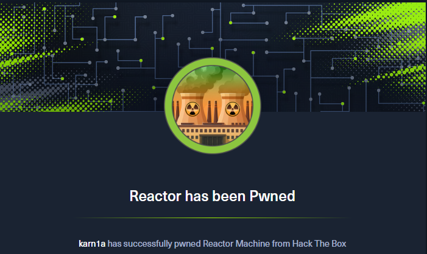

<p align="center">
  
</p>

# Nmap Scan

```bash
# Nmap 7.95 scan initiated Fri Jul 31 10:00:11 2026 as: /usr/lib/nmap/nmap --privileged -sV -sC -p- -Pn --min-rate=2000 -oN nmap_scan 10.129.245.214
Nmap scan report for 10.129.245.214
Host is up (0.15s latency).
Not shown: 65533 closed tcp ports (reset)
PORT     STATE SERVICE VERSION
22/tcp   open  ssh     OpenSSH 9.6p1 Ubuntu 3ubuntu13.16 (Ubuntu Linux; protocol 2.0)
| ssh-hostkey: 
|   256 ce:fd:0d:82:c0:23:ed:6e:4b:ea:13:fa:4f:ea:ef:b7 (ECDSA)
|_  256 f8:44:c6:46:58:7a:39:21:ef:16:44:e9:58:c2:f3:62 (ED25519)
3000/tcp open  ppp?
| fingerprint-strings: 
|   GetRequest: 
|     HTTP/1.1 200 OK
|     Vary: RSC, Next-Router-State-Tree, Next-Router-Prefetch, Next-Router-Segment-Prefetch, Accept-Encoding
|     x-nextjs-cache: HIT
|     x-nextjs-prerender: 1
|     x-nextjs-stale-time: 4294967294
|     X-Powered-By: Next.js
|     Cache-Control: s-maxage=31536000, 
|     ETag: "p02u6gnhufd8t"
|     Content-Type: text/html; charset=utf-8
|     Content-Length: 17175
|     Date: Fri, 31 Jul 2026 04:30:36 GMT
|     Connection: close
|     <!DOCTYPE html><html lang="en"><head><meta charSet="utf-8"/><meta name="viewport" content="width=device-width, initial-scale=1"/><link rel="stylesheet" href="/_next/static/css/414e1be982bc8557.css" data-precedence="next"/><link rel="preload" as="script" fetchPriority="low" href="/_next/static/chunks/webpack-db0a529a99835594.js"/><script src="/_next/static/chunks/4bd1b696-80bcaf75e1b4285e.js" async=""></script><script src="/_next/static/chunks/517-d083b552e04dead1.js" async=""></script><script s
|   HTTPOptions, RTSPRequest: 
|     HTTP/1.1 400 Bad Request
|     vary: RSC, Next-Router-State-Tree, Next-Router-Prefetch, Next-Router-Segment-Prefetch
|     Allow: GET
|     Allow: HEAD
|     Cache-Control: private, no-cache, no-store, max-age=0, must-revalidate
|     Date: Fri, 31 Jul 2026 04:30:38 GMT
|     Connection: close
|   Help, NCP, RPCCheck: 
|     HTTP/1.1 400 Bad Request
|_    Connection: close
1 service unrecognized despite returning data. If you know the service/version, please submit the following fingerprint at https://nmap.org/cgi-bin/submit.cgi?new-service :
SF-Port3000-TCP:V=7.95%I=7%D=7/31%Time=6A6C2501%P=x86_64-pc-linux-gnu%r(Ge
SF:tRequest,1A0E,"HTTP/1\.1\x20200\x20OK\r\nVary:\x20RSC,\x20Next-Router-S
SF:tate-Tree,\x20Next-Router-Prefetch,\x20Next-Router-Segment-Prefetch,\x2
SF:0Accept-Encoding\r\nx-nextjs-cache:\x20HIT\r\nx-nextjs-prerender:\x201\
SF:r\nx-nextjs-stale-time:\x204294967294\r\nX-Powered-By:\x20Next\.js\r\nC
SF:ache-Control:\x20s-maxage=31536000,\x20\r\nETag:\x20\"p02u6gnhufd8t\"\r
SF:\nContent-Type:\x20text/html;\x20charset=utf-8\r\nContent-Length:\x2017
SF:175\r\nDate:\x20Fri,\x2031\x20Jul\x202026\x2004:30:36\x20GMT\r\nConnect
<SNIP...>
```

The Nmap scan shows two ports open on the target machine:- Ports 22 and 3000

*This box is still active on HackTheBox. Once retired, this writeup will be published for public access as per HackTheBox's policy on publishing content from their platform*